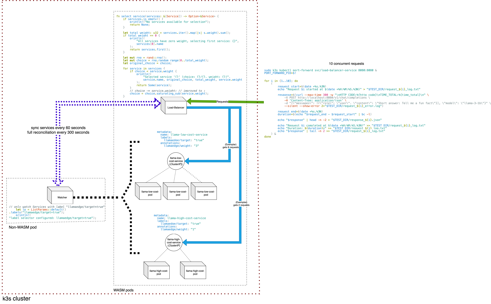

# Runwasi with WasmEdge runtime - *More Examples*

## Overview

This is a collection of __*more*__ demos about `runwasi` with `wasmedge runtime`.
Each demo is validated through a daily CI so as to streamline and validate the stability of both runwasi and wasmedge in container and cloud environments.

> Current demos include :
>  1. *Running `LlamaEdge's llama-api-server` `standalone`*
>  2. *Running `LlamaEdge's llama-api-server` inside `k8s`*
>  3. *Running `LlamaEdge's llama-api-server` as backend pods in `k8s` where requests are distributed by a `load-balancer`*

## Demos

### 1.  *Running `LlamaEdge's llama-api-server` `standalone`*
Here, we standalone run LlamaEdge's [llama-api-server](https://github.com/LlamaEdge/LlamaEdge/tree/main/llama-api-server) using `ctr` with the help of runwasi's `wasmedge-runtime`, wasmedge's `WASI-NN plugin`

  1. `../README.md`
  2. `./.github/workflows/ci.yml`

> expanded instructions (for local machine) : https://github.com/vatsalkeshav/instructions-wasmedge-runwasi/blob/master/docs/runwasi-wasmedge-demo_outside_k3s.md

### 2. *Running `LlamaEdge's llama-api-server` inside `k8s` environment*
Same as the `1`st demo, just inside k8s environment (*k3s used here*)

  1. `./k3s-example`
  2. `./.github/workflows/k3s-ci.yml`

### 3. *Running `LlamaEdge's llama-api-server` as backend pods in `k8s` where requests are distributed by a `load-balancer`*
This demo features `LlamaEdge's llama-api-server` (as WASM-pods) runnning different gguf models in a multi-pod environment - all managed by a load-balancer (also a WASM-pod) - assisted by a service-watcher utilizing `kube-rs` client (a regular non-WASM pod)
> How it works :

  1. `./k3s-load-balancer-example`
  2. `./.github/k3s-load-balancer-ci.yml`